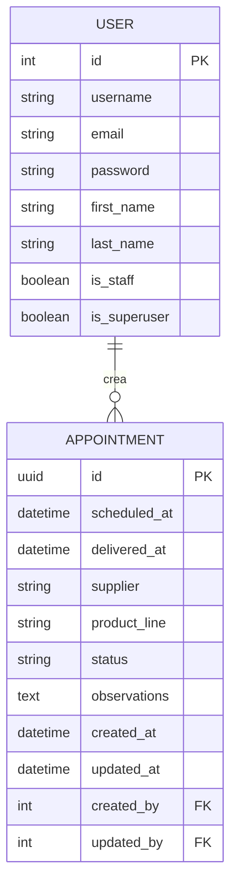

# Sistema de Gestión de Citas de Entrega

Sistema full-stack para la gestión de citas de entrega con reportes en tiempo real de tiempos promedio por línea de producto.

## Descripción General

Este sistema permite gestionar citas de entrega con seguimiento de estados, tiempos de entrega, y generación de reportes analíticos. Incluye autenticación de usuarios, CRUD completo de citas, y reportes con SQL nativo para análisis de rendimiento.

## Arquitectura

### Diagrama de Arquitectura

```
┌─────────────────────────────────────────────────────────────────┐
│                         Frontend (Next.js)                        │
│                    App Router + React + Tailwind                  │
│                         Port: 3000                                │
└────────────────────────────┬────────────────────────────────────┘
                             │ HTTP/REST API
                             │ JWT Authentication
┌────────────────────────────▼────────────────────────────────────┐
│                      Backend (Django REST)                       │
│              Django REST Framework + JWT + drf-spectacular       │
│                         Port: 8000                                │
└────────────────────────────┬────────────────────────────────────┘
                             │ PostgreSQL
                             │ Port: 5432
┌────────────────────────────▼────────────────────────────────────┐
│                    Database (PostgreSQL)                          │
│              Indexed tables for optimized queries                 │
└─────────────────────────────────────────────────────────────────┘
```

### Diagrama Entidad-Relación



Indexes:
- idx_scheduled_at: scheduled_at
- idx_status_scheduled: status, scheduled_at
- idx_supplier_status: supplier, status
- idx_product_status: product_line, status
```

## Instalación y Ejecución

### Requisitos Previos

- Docker
- Docker Compose
- Git

### Ejecución con Docker (Recomendado)

1. Clonar el repositorio:
```bash
git clone 
cd appointment-management-system
```

2. Configurar variables de entorno:
```bash
cp backend/.env.example backend/.env
cp frontend/.env.example frontend/.env
```

3. Levantar todos los servicios:
```bash
docker-compose up --build
```

4. Acceder a la aplicación:
- Frontend: http://localhost:3000
- Backend API: http://localhost:8000/api
- API Documentation (Swagger): http://localhost:8000/api/schema/swagger-ui/
- API Documentation (ReDoc): http://localhost:8000/api/schema/redoc/

### Ejecución sin Docker

#### Backend

1. Crear entorno virtual:
```bash
cd backend
python -m venv venv
source venv/bin/activate  # Windows: venv\Scripts\activate
```

2. Instalar dependencias:
```bash
pip install -r requirements.txt
```

3. Configurar base de datos PostgreSQL localmente y actualizar `.env`

4. Ejecutar migraciones:
```bash
python manage.py migrate
```

5. Sembrar datos de prueba:
```bash
python manage.py seed_data
```

6. Iniciar servidor:
```bash
python manage.py runserver
```

#### Frontend

1. Instalar dependencias:
```bash
cd frontend
npm install
```

2. Configurar variables de entorno en `.env`

3. Iniciar servidor de desarrollo:
```bash
npm run dev
```

## Variables de Entorno

### Backend (.env)

```bash
# Django Settings
SECRET_KEY=your-secret-key-here-change-in-production
DEBUG=True
ALLOWED_HOSTS=localhost,127.0.0.1

# Database
DB_NAME=appointment_db
DB_USER=postgres
DB_PASSWORD=postgres
DB_HOST=db
DB_PORT=5432

# JWT Settings
JWT_ACCESS_TOKEN_LIFETIME_MINUTES=60
JWT_REFRESH_TOKEN_LIFETIME_DAYS=7

# CORS
CORS_ALLOWED_ORIGINS=http://localhost:3000,http://127.0.0.1:3000
```

### Frontend (.env)

```bash
NEXT_PUBLIC_API_URL=http://localhost:8000/api
```

## Documentación de la API

La API está documentada automáticamente con drf-spectacular (OpenAPI 3.0).

- **Swagger UI**: http://localhost:8000/api/schema/swagger-ui/
- **ReDoc**: http://localhost:8000/api/schema/redoc/
- **OpenAPI Schema**: http://localhost:8000/api/schema/

### Endpoints Principales

#### Autenticación
- `POST /api/auth/token/` - Login (obtener tokens JWT)
- `POST /api/auth/token/refresh/` - Refrescar access token
- `POST /api/appointments/register/operator/` - Registrar nuevo usuario operador
- `POST /api/appointments/logout/` - Logout (invalidar refresh token)

#### Citas
- `GET /api/appointments/` - Listar citas (con filtros: supplier, product_line, status, date_from, date_to)
- `POST /api/appointments/` - Crear nueva cita
- `GET /api/appointments/{id}/` - Obtener detalle de cita
- `PUT /api/appointments/{id}/` - Actualizar cita
- `DELETE /api/appointments/{id}/` - Eliminar cita (soft-delete: status='Cancelada')
- `GET /api/appointments/dashboard/` - Estadísticas del dashboard
- `GET /api/appointments/report/` - Reporte de tiempos por línea de producto (date_from/date_to opcionales)

## Pruebas Unitarias

### Ejecutar pruebas del backend:

```bash
cd backend
python manage.py test appointments
```

### Pruebas implementadas:

1. **Test de validación de fecha pasada**: Verifica que no se pueden crear citas con fecha en el pasado
2. **Test de estado Entregada requiere delivered_at**: Verifica que el estado 'Entregada' requiere el campo delivered_at
3. **Test de transición de estado inválida**: Verifica que no se permiten transiciones de estado inválidas
4. **Test de autenticación requerida**: Verifica que usuarios no autenticados reciben 401
5. **Test de endpoint de reporte sin fechas**: Verifica que el reporte retorna datos sin parámetros de fecha
6. **Test de endpoint de reporte con fechas**: Verifica que el reporte filtra correctamente por rango de fechas
7. **Test de soft-delete**: Verifica que eliminar una cita cambia el status a 'Cancelada'

## Datos de Prueba

El sistema incluye un comando de seeding que crea automáticamente:

- **3 usuarios de prueba**:
  - admin / admin123 (superusuario)
  - manager / manager123 (staff)
  - operator / operator123 (usuario regular)

- **20 citas** en distintos estados, proveedores y productos

Para ejecutar el seeding:
```bash
python manage.py seed_data
```

## Características Implementadas

### Backend (Django REST Framework)
- ✅ Autenticación JWT con refresh tokens y blacklist
- ✅ CRUD completo de citas con validaciones
- ✅ Reporte con SQL nativo optimizado (por línea de producto)
- ✅ Dashboard con estadísticas
- ✅ Documentación automática con drf-spectacular
- ✅ Manejo de errores HTTP semántico
- ✅ Índices en base de datos
- ✅ Tests unitarios (7 tests)
- ✅ Seed data command
- ✅ Soft-delete (status='Cancelada' al eliminar)
- ✅ Custom User model (AbstractUser)

### Frontend (Next.js App Router)
- ✅ Login con manejo de errores visible
- ✅ Dashboard con estadísticas visuales
- ✅ Lista de citas con filtros (dropdowns supplier/product_line) y paginación
- ✅ Formulario crear/editar con validaciones
- ✅ Reporte con gráfico de barras (Recharts)
- ✅ Mobile-first responsive design
- ✅ Protección de rutas
- ✅ Manejo de estados de carga y errores
- ✅ Logout con invalidación de refresh token
- ✅ Interfaz consistente y usable

### DevOps
- ✅ Docker Compose funcional (1 comando)
- ✅ README completo con instrucciones
- ✅ Variables de entorno configuradas
- ✅ Migraciones automáticas
- ✅ Datos de prueba incluidos
- ✅ CI/CD con GitHub Actions (lint, test, build)


### Buenas Prácticas Aplicadas

- **Type hints**: Python con type hints para mejor maintainability
- **TypeScript**: Frontend completamente tipado
- **RESTful**: Verbos HTTP y códigos de respuesta semánticamente correctos
- **Clean code**: Nombres descriptivos sin over-engineering
- **DRY**: Don't Repeat Yourself aplicado consistentemente
- **SOLID**: Principios de diseño orientado a objetos
- **Mobile-first**: Diseño responsive desde móvil hacia desktop
- **Error handling**: Manejo explícito de errores en todos los niveles

## Decisiones Técnicas y Justificaciones

### JWT con Blacklist vs Sesiones

Se eligió JWT (JSON Web Tokens) con refresh tokens y blacklist en lugar de sesiones tradicionales basadas en cookies por las siguientes razones:

- **Stateless**: Los tokens JWT son stateless, lo que significa que no requieren almacenamiento en el servidor. Esto reduce la carga en la base de datos y mejora la escalabilidad.
- **Compatible con SPA**: Las Single Page Applications (SPAs) como Next.js funcionan mejor con tokens que con cookies, ya que los tokens pueden almacenarse en localStorage y enviarse en cada request sin problemas de CORS.
- **Escalabilidad horizontal**: Al ser stateless, el sistema puede escalar horizontalmente sin preocuparse por compartir sesiones entre múltiples servidores. Cualquier servidor puede validar un token JWT sin necesidad de consultar una base de datos centralizada.
- **Blacklist de refresh tokens**: Se implementa blacklist para refresh tokens para permitir revocación de sesiones sin perder la ventaja de stateless de los access tokens de corta duración.

### Next.js 14 con App Router

Se eligió Next.js 14 con App Router en lugar de otras opciones como React Router + CRA o Next.js con Pages Router:

- **SSR (Server-Side Rendering)**: App Router permite renderizado en el servidor por defecto, mejorando el SEO y el tiempo de carga inicial (Time to First Byte).
- **Routing nativo**: El sistema de routing basado en archivos de App Router es más intuitivo y permite layouts anidados, loading states, y error boundaries de forma nativa.
- **TypeScript de primera clase**: Next.js 14 tiene soporte nativo y optimizado para TypeScript, con tipos generados automáticamente para rutas y componentes.
- **Server Components**: Permite usar Server Components por defecto, reduciendo el bundle size del cliente y mejorando el rendimiento.
- **Streaming**: Soporte nativo de streaming para mejorar la percepción de carga en conexiones lentas.

### PostgreSQL vs Otras Bases de Datos

Se eligió PostgreSQL en lugar de MySQL, SQLite u otras opciones:

- **Soporte nativo de UUID**: PostgreSQL tiene soporte nativo para UUID como tipo de dato, lo que es ideal para claves primarias no secuenciales y distribuidas.
- **Índices parciales**: PostgreSQL permite índices parciales (índices con condiciones WHERE), útiles para optimizar queries específicos como reportes filtrados por estado.
- **EXTRACT/EPOCH en SQL nativo**: Funciones nativas para manipulación de fechas y tiempos, esenciales para el cálculo de tiempos promedio de entrega en el reporte.
- **Full-text search**: Soporte nativo de búsqueda de texto completo para futuras expansiones.
- **JSONB**: Soporte nativo de JSON binario para campos flexibles si se requiere en el futuro.
- **ACID completo**: Cumplimiento estricto de propiedades ACID para integridad de datos transaccionales.

### Separación en Apps users y appointments

Se separó el código en dos apps Django (users y appointments) en lugar de una sola app monolítica:

- **Principio de responsabilidad única**: Cada app tiene una responsabilidad clara: users maneja autenticación y usuarios, appointments maneja la lógica de negocio de citas.
- **Escalabilidad por dominio**: Esta separación permite escalar cada dominio de forma independiente. Por ejemplo, se podría mover users a un microservicio separado en el futuro sin afectar appointments.
- **Mantenibilidad**: El código está organizado por dominio de negocio, facilitando la navegación y comprensión del código base.
- **Reutilización**: La app users puede reutilizarse en otros proyectos que requieran autenticación similar.
- **Testing aislado**: Permite tests más enfocados y aislados por dominio de negocio.

## Supuestos Asumidos

### Soft-Delete en Citas

Se asume que el comportamiento esperado al "eliminar" una cita es un soft-delete: el estado cambia a "Cancelada" en lugar de eliminar físicamente el registro de la base de datos. Esto mantiene el historial completo para auditoría y reportes, permitiendo análisis de tendencias de cancelaciones.

### Manejo de Zonas Horarias

Se asume que todas las zonas horarias se manejan con `America/Bogota` configurado en Django settings (`TIME_ZONE = 'America/Bogota'`). Esto significa que:
- Todas las fechas se almacenan en UTC en la base de datos.
- Las fechas se convierten a America/Bogota al mostrarse al usuario.
- Los cálculos de tiempos (como el reporte de tiempos de entrega) consideran la zona horaria configurada.

### Proveedores Fijos

Se asume que los proveedores son fijos (A, B, C) y no requieren su propio CRUD. Esto significa:
- Los proveedores son valores enumerados (choices) en el modelo.
- No hay una tabla separada para proveedores.
- No se prevé la necesidad de agregar/eliminar proveedores dinámicamente.
- Si en el futuro se requiere CRUD de proveedores, se deberá crear un modelo separado y migrar los datos existentes.

### Reporte Sin Fechas

Se asume que cuando el endpoint de reporte se llama sin parámetros de fecha (date_from y date_to), debe retornar todos los registros históricos disponibles. Esto permite:
- Visualización de tendencias históricas completas.
- Análisis de todo el historial de entregas.
- Flexibilidad para que el frontend decida si filtrar por fechas o mostrar todo el historial.
